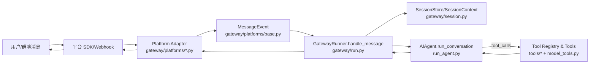

# 项目概览与架构

Hermes Agent 是一个“长驻型 AI Agent + 多通道消息网关”的组合系统：

- Agent：负责与模型交互、循环工具调用、记忆与上下文压缩、失败恢复等（核心入口：[run_agent.py](file:///workspace/run_agent.py)）。
- Gateway：负责连接 Telegram/Discord/Slack/Feishu 等平台，把平台事件统一抽象为 MessageEvent，并把响应送回原通道（核心入口：[gateway/run.py](file:///workspace/gateway/run.py)）。
- Tools：提供文件、终端、浏览器、MCP、记忆等工具能力，支持 toolset 选择与守卫（入口：[tools/registry.py](file:///workspace/tools/registry.py)、[model_tools.py](file:///workspace/model_tools.py)）。
- CLI/TUI：本地交互入口、配置向导、网关控制、会话管理（入口：[hermes_cli/](file:///workspace/hermes_cli)）。

## 进程形态

常见部署会跑两个主要形态之一（也可以同时存在）：

- CLI 交互：`hermes` → 直接在本地运行 agent loop（无需 gateway）。
- Messaging 网关：`hermes gateway` → 常驻进程，监听各平台事件，内部为每个会话调度 agent run（可选流式输出）。

## 核心数据流（消息链路）

关键抽象：

- 入站统一抽象为 [MessageEvent](file:///workspace/gateway/platforms/base.py#L869-L915)，包含 text/media/reply_to 等归一化字段。
- 入站来源统一抽象为 [SessionSource](file:///workspace/gateway/session.py#L71-L115)，包含 platform/chat_id/user_id/thread_id 等路由信息。
- 发送统一抽象为 `adapter.send(chat_id, content, reply_to, metadata)`（接口：[BasePlatformAdapter.send](file:///workspace/gateway/platforms/base.py#L1424-L1443)）。

## Agent 内部结构（高层）

Agent 的核心职责是把“一个用户消息”转成“一个最终回复”，并在过程中自动调用工具：

- 模型/Provider 选择与路由（多 Provider/Failover）：见 [run_agent.py](file:///workspace/run_agent.py) 中的 provider/adapter 逻辑。
- 工具定义与调用：`get_tool_definitions()`、`handle_function_call()` 来自 [model_tools.py](file:///workspace/model_tools.py)（底层注册表：[tools/registry.py](file:///workspace/tools/registry.py)）。
- 上下文构建：包括 SOUL.md、技能提示、目录提示、记忆片段等（见 [agent/prompt_builder.py](file:///workspace/agent/prompt_builder.py)）。
- 上下文压缩：长会话下将历史压缩并保持可继续（见 [agent/context_compressor.py](file:///workspace/agent/context_compressor.py)）。

## Gateway 的会话与并发模型

Gateway 的并发核心点：

- 同一个 session_key 下默认串行（避免同一会话并发跑多个 agent），适配器层用 `_active_sessions` 作为 guard（见 [BasePlatformAdapter.handle_message](file:///workspace/gateway/platforms/base.py#L2505-L2620)）。
- 新消息可打断当前会话：在适配器层写入 `_pending_messages` 并触发 interrupt event；GatewayRunner 在 run 中轮询并调用 agent.interrupt（见 [gateway/run.py](file:///workspace/gateway/run.py) 相关逻辑）。
- 流式输出：可用 GatewayStreamConsumer 通过“编辑消息/分段发送”的方式逐步把 token 推到平台（见 [gateway/stream_consumer.py](file:///workspace/gateway/stream_consumer.py)）。

